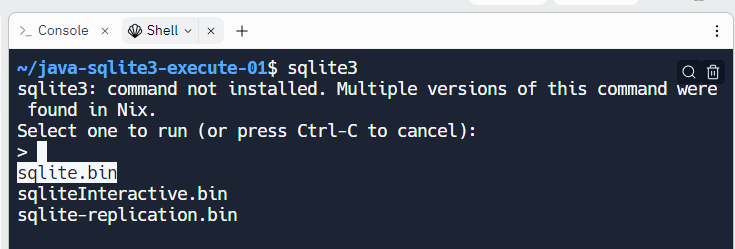

## 🟩 金曜 MEMO

- ### ✅ 9月15日

- ### Replit 上でクリップボードにある画像を CTRL + V すると画像ファイル化できる
  - WIN + V を活用しよう
    - [Windows キーを使ったショートカットで作業効率をアップ](https://www.microsoft.com/ja-jp/biz/smb/column-shortcuts-using-windows-key.aspx)

- ### JavaScript で HTML を出力する方法
  ```javascript
  document.write("<h1>こんにちは世界</h1>");
  ```

- ### Replit を使ってメモ作成
  - ### [マークダウンを使おう](https://gist.github.com/mignonstyle/083c9e1651d7734f84c99b8cf49d57fa)
    - ### ファイル名.md
    - ### テーブル
      | タイトル1 | タイトル2 |
      | --- | --- |
      | 明細 セル(1,1)  | 明細 セル(1,2)  |
      | 明細 セル(2,1)  | 明細 セル(2,2)  |
      | 明細 セル(3,1)  | 明細 セル(3,2)  |
      | 明細 セル(4,1)  | 明細 セル(4,2)  |

```
- ### Replit を使ってメモ作成
  - ### [マークダウンを使おう](https://gist.github.com/mignonstyle/083c9e1651d7734f84c99b8cf49d57fa)
    - ### ファイル名.md
    - ### テーブル
      | タイトル1 | タイトル2 |
      | --- | --- |
      | 明細 セル(1,1)  | 明細 セル(1,2)  |
      | 明細 セル(2,1)  | 明細 セル(2,2)  |
      | 明細 セル(3,1)  | 明細 セル(3,2)  |
      | 明細 セル(4,1)  | 明細 セル(4,2)  |
```
      

<br>





### パースペクティブの選択


### [サンプルコード(WindowBuilder/Eclipse)](https://replit.com/@sworc/swing-0914-1#WindowBuilder.md)
